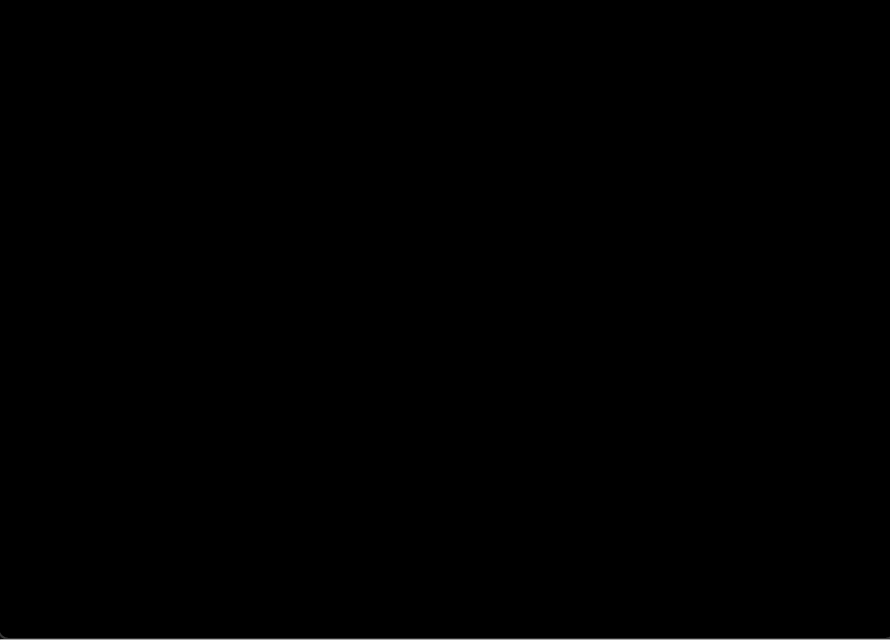

# Simple WFC

Simple wave function collapse implemented in Java. Generates textures from small tiles based on constraint rules, with real-time visualization of the algorithm stepping through each cell.



## How it Works

Each tile defines **ports** on its edges (north, south, east, west). Two tiles can sit next to each other only if their adjacent ports match. The algorithm picks the most constrained cell, collapses it to one tile, and propagates the constraints outward. This is repeated until the entire grid is filled. If it hits a dead end, it backtracks and tries a different choice.

Implemented: 
* Rotations in 2d
* Output texture tileability
* Backtracking

TODO:

* 3D
* Symmetries
* ...

## How to Run

```
./gradlew desktop:run
```

## Controls

| Key     | Action                    |
|---------|---------------------------|
| `Space` | Step one round (observe + propagate) |
| `1`     | Run to completion         |
| `o`     | Observe step only         |
| `p`     | Propagate step only       |
| `g`     | Print grid to console     |
| `c`     | Print constraints         |
| `r`     | Print rotations           |

## Tiled model — generate circuit texture
  ./gradlew core:generate --args="tiled assets --basename circ --tiling --seed 229 --output circuit.png"

## Overlapping model — generate texture from any sample image
  ./gradlew core:generate --args="overlapping sample.png --size 64x64 --tiling --output result.png"

## Batch — generate 10 variations
  ./gradlew core:generate --args="overlapping sample.png --size 64x64 --count 10 --seed 1 --output textures/"

## Test output:

### Circuits
Input tiles:

       

Output:


### Test:
Input tiles:

           

Output:


### Cross:
Input tiles:

   

Output:


### Some fun:


## Dependencies

Displaying is done using LibGDX